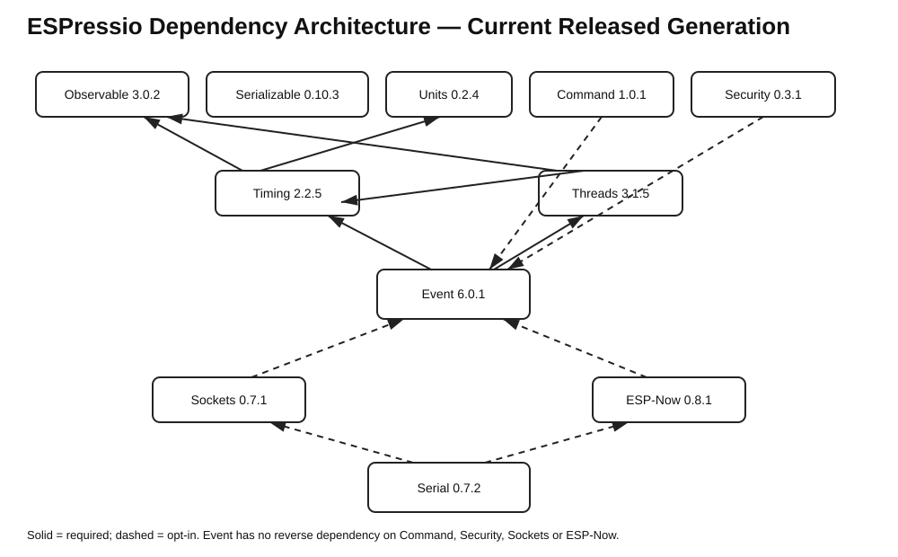

# ESPressio Dependency Chart — Current Released Generation



This document is the canonical snapshot of the current released ESPressio dependency generation. Arrows point from the consuming library to the library it consumes.

- **Required** — the dependency is part of the library's normal/core contract.
- **Opt-in** — the dependency is introduced only when the corresponding integration/header is selected.

## Released generation

```text
Observable    3.0.2
Serializable  0.10.3
Units         0.2.4
Timing        2.2.5
Threads       3.1.5
Event         6.0.1
Command       1.0.1
Security      0.3.1
Sockets       0.7.1
ESP-Now       0.8.1
Serial        0.7.2
```

## Required dependencies

```text
Observable 3.0.2
    -> none

Serializable 0.10.3
    -> none

Units 0.2.4
    -> none

Timing 2.2.5
    -> Units >= 0.2.3 < 1.0.0
    -> Observable >= 3.0.2 < 4.0.0

Threads 3.1.5
    -> Timing >= 2.2.5 < 3.0.0
    -> Observable >= 3.0.2 < 4.0.0

Event 6.0.1
    -> Threads >= 3.1.4 < 4.0.0
    -> Timing >= 2.2.5 < 3.0.0
    -> Observable >= 3.0.2 < 4.0.0

Command 1.0.1
    -> Observable >= 3.0.2 < 4.0.0

Security 0.3.1
    -> Observable >= 3.0.2 < 4.0.0

Sockets 0.7.1
    -> Observable >= 3.0.2 < 4.0.0

ESP-Now 0.8.1
    -> Timing >= 2.2.5 < 3.0.0
    -> Observable >= 3.0.2 < 4.0.0

Serial 0.7.2
    -> none in the core package
```

## Opt-in integrations

```text
Units
    - - -> Serializable >= 0.10.2 < 1.0.0
            Serializable Unit variants

Event
    - - -> Serializable >= 0.10.2 < 1.0.0
            Serializable Events / Event Transport

Command
    - - -> Event >= 6.0.1 < 7.0.0
            Command-owned Event types / CommandRegistryEventBridge

Security
    - - -> Event >= 6.0.1 < 7.0.0
            Security-owned Event types / TransportSecurityEventBridge

Sockets
    - - -> Event >= 6.0.1 < 7.0.0
    - - -> Command >= 1.0.1 < 2.0.0
    - - -> Security >= 0.3.1 < 1.0.0
    - - -> Timing >= 2.2.5 < 3.0.0

ESP-Now
    - - -> Event >= 6.0.1 < 7.0.0
    - - -> Command >= 1.0.1 < 2.0.0
    - - -> Security >= 0.3.1 < 1.0.0

Serial
    - - -> Command >= 1.0.1 < 2.0.0
    - - -> Security >= 0.3.1 < 1.0.0
    - - -> Sockets >= 0.7.0 < 1.0.0
    - - -> ESP-Now >= 0.8.0 < 1.0.0
    - - -> Event >= 6.0.1 < 7.0.0
    - - -> Serializable >= 0.10.2 < 1.0.0
    - - -> Timing >= 2.2.5 < 3.0.0
    - - -> Threads >= 3.1.4 < 4.0.0
```

`JsonCommandInterpreter` optionally consumes external **ArduinoJson 7.x**. ArduinoJson is not an ESPressio library and is therefore not represented as an ESPressio graph edge.

## Dependency-direction invariants

Event 6.0.1 owns the generic Event mechanism. Domain-specific Event types and bridges belong to the lowest-order library that owns the represented concept without introducing a reverse dependency:

```text
Command  - - -> Event
Security - - -> Event
Sockets  - - -> Event
ESP-Now  - - -> Event

Event -> Command   NONE
Event -> Security  NONE
Event -> Sockets   NONE
Event -> ESP-Now   NONE
```

Timing and Threads Event bridges remain in Event because Event already requires Timing and Threads for its own responsibilities; moving those bridges upstream would create reverse dependencies.

Serial remains terminal/downstream. No upstream ESPressio library should depend on Serial.

## Standalone repositories

ESPressio Tree and ESPressio WiFi are not dependency edges in the coordinated graph above. Tree is a standalone generic component. WiFi currently has no implemented public API and must not be treated as a dependency of the released stack merely because legacy package metadata exists in its repository.
